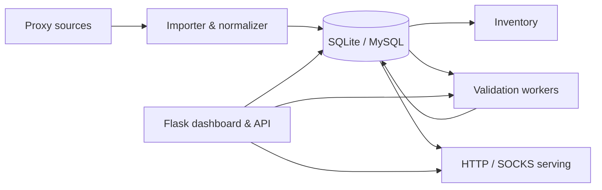

<div align="center">
  

  # SecPath ProxyPool

  **A local-first control plane for importing, validating, analyzing, and serving proxy pools.**

  <p>
    
    
    
    
    
  </p>
</div>

SecPath ProxyPool combines proxy ingestion, capability validation, operational monitoring, pool analytics, and local HTTP/SOCKS serving in one security-conscious Flask application. It is designed for operators who need to understand **which proxies are usable, for what purpose, and with what level of confidence**.

## Highlights

- **Inventory workspace** — searchable, filterable proxy inventory with scoped bulk actions and detailed health metadata.
- **Source management** — manual, file, URL, and grouped-source imports with a non-mutating preview before execution.
- **Validation center** — reusable validation profiles, live progress, pause/resume, recent outcomes, and bounded logs.
- **Serving center** — HTTP/SOCKS listener profiles with capability-aware candidate preflight and rotation policies.
- **Insights** — health, latency, reliability, protocol, capability, freshness, geography, and provider concentration views.
- **Operations** — diagnostics, private backups, guarded restore, runtime cleanup, and release-readiness checks.
- **Access control** — database-backed users, roles, permission overrides, API sessions, and per-user proxy scope.
- **Local-first security** — loopback dashboard binding by default, CSRF protection, credential redaction, SSRF controls, and process identity checks.

## Architecture



| Component | Responsibility |
| --- | --- |
| `dashboard/` | Web dashboard, authentication, authorization, and JSON API |
| `proxy_importer/` | Source parsing and proxy normalization |
| `proxy_monitor/` | Reachability and capability validation |
| `proxy_server/` | Local HTTP/SOCKS listeners backed by the proxy pool |
| `database.py` | SQLAlchemy models and database lifecycle |
| `scripts/` | Setup, runtime, backup, migration, health, and release tooling |
| `tests/` | Regression, security, lifecycle, UI, and end-to-end tests |

## Requirements

- Linux or WSL
- Python 3.11 or newer
- SQLite for the default local setup
- MySQL is optional and must be configured explicitly

## Quick start

### 1. Create a virtual environment

```bash
python3 -m venv .venv
source .venv/bin/activate
python3 -m pip install --upgrade pip
python3 -m pip install -r requirements.txt
```

On Debian or Ubuntu, install `python3-venv` first if the `venv` module is unavailable:

```bash
sudo apt update
sudo apt install python3-venv
```

Using a virtual environment avoids the `externally-managed-environment` error enforced by newer Debian/Ubuntu Python installations.

### 2. Create local configuration

```bash
cp .env.example .env
python3 scripts/rotate_local_secrets.py
```

The secret rotation script writes independent `FLASK_SECRET_KEY` and `JWT_SECRET` values directly to `.env`, does not print them, and sets the file mode to `0600`.

The default database configuration is:

```dotenv
DB_TYPE=sqlite
SQLITE_DB_PATH=proxies.db
```

### 3. Initialize an administrator

```bash
python3 scripts/create_admin.py --username admin --role admin
```

No built-in default password is shipped with the application.

### 4. Start the dashboard

```bash
bash scripts/run_dashboard.sh
```

Open:

```text
http://127.0.0.1:5003
```

The development dashboard binds to loopback by default. A non-loopback bind requires an explicit trusted-network override.

## Core workflow

1. Add or save proxy sources in **Sources**.
2. Preview normalization and duplicate handling before import.
3. Inspect and filter imported records in **Inventory**.
4. Create a profile in **Validation** and run capability checks.
5. Review health, latency, reliability, and freshness in **Insights**.
6. Create a listener in **Serving** using only the required protocols and capabilities.
7. Use **Operations** for diagnostics, backups, restore, and guarded maintenance.

## Verification

Run the complete disposable-database health suite:

```bash
bash scripts/health_check.sh
```

Run repository hygiene and static analysis:

```bash
bash scripts/repo_hygiene_check.sh
ruff check dashboard tests scripts
```

Run the full release-readiness check without deploying or restarting services:

```bash
bash scripts/release_check.sh
```

After committing, require a clean Git working tree as well:

```bash
bash scripts/release_check.sh --require-clean
```

All automated checks use disposable SQLite databases and must not modify the working `proxies.db`.

## Public utility: SecPath Proxy Lists

[`proxy.secpath.space`](https://proxy.secpath.space) is the public companion utility for the project. A scheduled GitHub Actions workflow collects public proxy candidates, validates them from a GitHub-hosted runner, ranks the strongest current results, and publishes three Excel exports:

- Top 20 SOCKS5 proxies
- Top 20 SOCKS4 proxies
- Top 20 HTTP/HTTPS proxies

The site is static. It does not expose the dashboard, a database, a runtime API, or proxy endpoints in page HTML or metadata. See [`docs/PUBLIC_PROXY_EXPORT.md`](docs/PUBLIC_PROXY_EXPORT.md).

## Backups and migration

Create a private, integrity-checked SQLite backup:

```bash
python3 scripts/sqlite_backup.py backup \
  --source proxies.db \
  --directory backups
```

Verify a backup:

```bash
python3 scripts/sqlite_backup.py verify backups/proxies_backup_*.sqlite
```

Migration is dry-run by default:

```bash
python3 migrate.py \
  --source proxies.db \
  --target-url 'sqlite:////tmp/proxypool-target.sqlite'
```

Add `--execute` only after reviewing the plan. Destructive replacement requires an additional explicit confirmation flag.

## Security model

SecPath ProxyPool treats proxy credentials and runtime controls as sensitive data.

- Browser mutations require CSRF tokens.
- General inventory and status APIs redact upstream usernames and passwords.
- Credential-bearing export requires an explicit permission and request flag.
- URL imports block loopback, private, link-local, and reserved destinations and validate the connected peer.
- Dashboard and proxy listeners default to loopback.
- Public listeners require authentication or an explicit unsafe override.
- Monitor and server processes use ownership claims and exact process-identity checks.
- Runtime cleanup refuses to proceed while owned or orphaned processes are active.
- The final active administrator cannot be deleted, disabled, or demoted.

See [`docs/SECURITY.md`](docs/SECURITY.md) for the complete security boundary.

## Documentation

| Document | Topic |
| --- | --- |
| [`RUNBOOK.md`](RUNBOOK.md) | Operator commands and recovery procedures |
| [`docs/SECURITY.md`](docs/SECURITY.md) | Security controls and trust boundaries |
| [`docs/MONITOR_LIFECYCLE.md`](docs/MONITOR_LIFECYCLE.md) | Monitor process lifecycle and recovery |
| [`docs/PROXY_SERVER_CORE.md`](docs/PROXY_SERVER_CORE.md) | HTTP/SOCKS serving behavior |
| [`docs/INVENTORY_UI.md`](docs/INVENTORY_UI.md) | Inventory workspace |
| [`docs/SOURCES_UI.md`](docs/SOURCES_UI.md) | Source and import workflow |
| [`docs/VALIDATION_UI.md`](docs/VALIDATION_UI.md) | Validation workspace |
| [`docs/SERVING_UI.md`](docs/SERVING_UI.md) | Serving workspace |
| [`docs/INSIGHTS_OPERATIONS_UI.md`](docs/INSIGHTS_OPERATIONS_UI.md) | Insights, Operations, and Access |
| [`docs/LOCAL_RUNTIME.md`](docs/LOCAL_RUNTIME.md) | Local binding and secret rotation |
| [`docs/RELEASE_READINESS.md`](docs/RELEASE_READINESS.md) | Backup, migration, and release checks |
| [`docs/PUBLIC_PROXY_EXPORT.md`](docs/PUBLIC_PROXY_EXPORT.md) | SecPath Proxy Lists and GitHub Pages publishing |

## Runtime files

Do not commit local runtime data, including:

- `.env`
- `proxies.db` and database backups
- `.monitors.json`, `.servers.json`, and `.server_config.json`
- `.runtime/`, `progress/`, PID files, logs, caches, and generated archives

The repository hygiene check rejects accidentally tracked runtime files.

## Production note

`scripts/run_dashboard.sh` starts Flask's development server and is intended for local operation only. A production deployment requires an approved WSGI/reverse-proxy configuration, TLS, secure cookies, persistent secrets, backups, and an explicit network exposure review.

## Contributing

Before opening a pull request:

```bash
bash scripts/release_check.sh --require-clean
```

Keep secrets, proxy credentials, databases, generated lists, and runtime logs out of commits and issue reports.

## License

No open-source license has been selected yet. Add a `LICENSE` file before granting public reuse, modification, or redistribution rights.

---

**SecPath ProxyPool v1.0.0** · Developed by **Mahdi Alemi**
